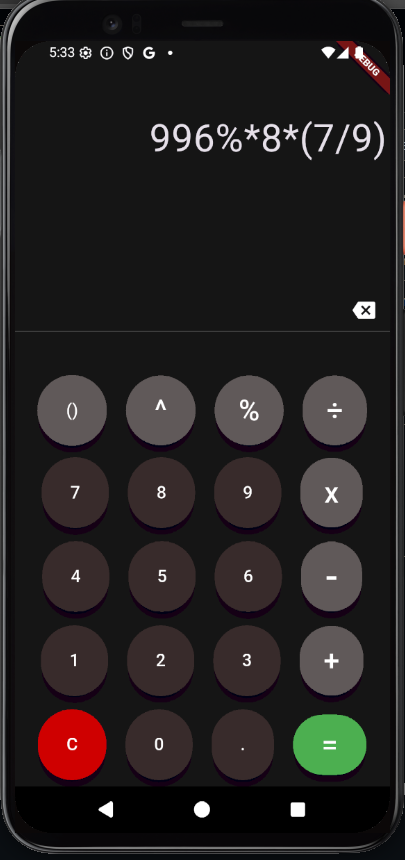

# Calculadora_app

##novas funções implementadas em calculadora 2.0

- Visual dos botões melhorados
- Edição da expressão melhorada

## em desenvolvimento

-implementar parenteses em tempo de edição

---

Tudo isso feito em flutter, o melhor framework para desenvolvimento mobile
