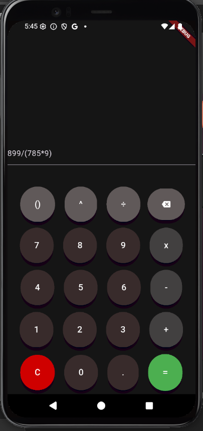

# Calculadora_app

  <strong>Antes</strong> &nbsp;&nbsp;&nbsp;&nbsp;&nbsp;&nbsp;&nbsp;&nbsp;&nbsp;&nbsp;&nbsp;&nbsp;&nbsp;&nbsp;&nbsp;&nbsp;&nbsp;&nbsp;&nbsp;&nbsp;&nbsp;&nbsp;&nbsp;&nbsp;&nbsp;&nbsp;&nbsp;&nbsp;&nbsp;&nbsp;&nbsp;&nbsp;&nbsp;&nbsp;&nbsp;&nbsp;&nbsp;&nbsp;&nbsp;&nbsp;&nbsp;&nbsp;&nbsp;&nbsp;&nbsp;&nbsp;
  <strong>Depois</strong>  
  
  &nbsp;&nbsp;&nbsp;
  

## novas funções implementadas em calculadora 2.0

- Visual dos botões melhorados
- Edição da expressão melhorada
- Responsividade melhorada

## em desenvolvimento

-implementar parenteses em tempo de edição

---

Bom dia amigos, meu nome é Elvis e eu sonho em trabalhar com desenvolvimento mobile,IoT e robótica. Busco por meio do flutter,
 não só criar aplicativos interessantes, mas também integrá-los com um sistema embarcado

---
Tudo isso feito em flutter, o melhor framework para desenvolvimento mobile
